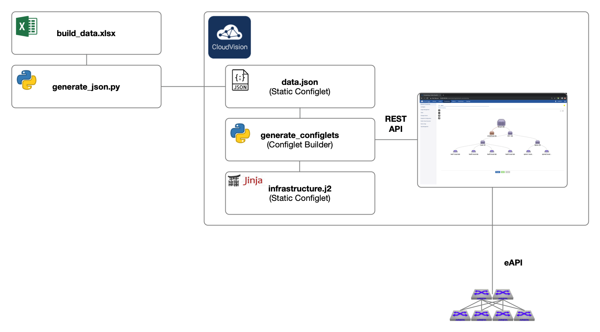

# cvp-excel-automation-demo

## Overview

This CVP automation demo has been designed with the following goals in mind:

* Avoid manual box-by-box configuration via CLI
* Provide a simple input method for provisioning data (interfaces, VLANs, VRFs, etc.)
* Provisioning data should be stored in a structured data format for easy parsing by scripts
* It should be possible to load provisioning data from an external data source
* Use CloudVision's API and built-in provisioning features (validation, change control, audit, etc.)

The solution is comprised of five components:

1. Input spreadsheet for infrastructure and tenant details
2. Python script to convert the input spreadsheet to JavaScript Object Notation (JSON) format
3. Jinja2 template for Arista EOS devices
4. CloudVision Configlet Builders to generate and update device configurations
5. CloudVision Change Control to deploy configurations using eAPI



## Prerequisites

Ensure the following prerequisites are met before proceeding:

1. All switches are racked and powered up
2. All connections are in place (fabric, out of band, console)
3. CloudVision Portal 2020.1.1 or later is deployed on the out of band network
4. Configlet Builders and Jinja2 template loaded on CVP
5. A DHCP server is deployed on the out of band network for Zero Touch Provisioning (ZTP)
6. An automation host with Python3, Pandas DataFrame and Excel reader libraries

```
pip install pandas xlrd
```

## Day 1 Provisioning Workflow

Day 1 provisioning covers the initial deployment of a greenfield leaf and spine fabric. 

The high-level workflow is as follows:

1. Update input spreadsheet with infrastructure and tenant details (build_data.xlsx)
2. Run script to generate JSON file from input spreadsheet (generate_json.py)

```
root@automation-host:~# ./generate_json.py -f build_data.xlsx
Saved file: data.json
```

3. Upload required Configlet Builder, data.json and Jinja2 template to CVP

```
root@automation-host:~# python3 upload_data.py
```

4. Run the Configlet Builder to generate device configlets (generate_configlets)
5. Run the Configlet Builder to create containers (add_containers)
6. Run the Configlet Builder to deploy device configlets (deploy_configlets)
7. Approve and execute change control

## Day 2 Provisioning Workflow

Day 2 provisioning covers adds/moves/changes to the leaf and spine fabric. Examples include:

* Adding a new leaf switch
* Changing infrastructure addresses or BGP
* dding a new VLAN or VRF
* Adding a new server interface

The high-level workflow is as follows:

1. Update input spreadsheet with infrastructure and tenant details (build_data.xlsx)
2. Run script to generate JSON file from input spreadsheet (generate_json.py)
3. Run the Configlet Builder to generate device configlets (generate_configlets)
4. Approve and execute change control
